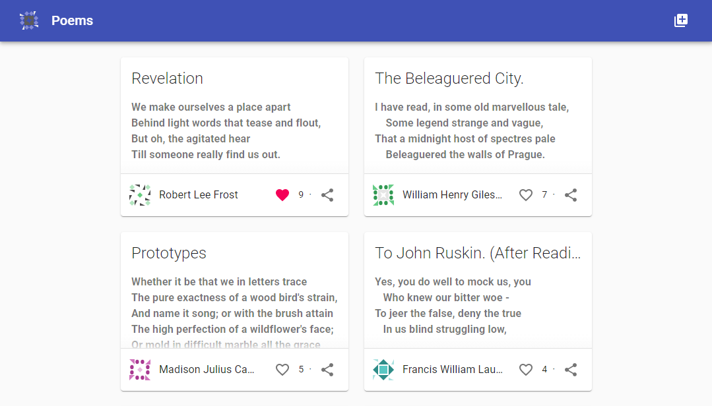
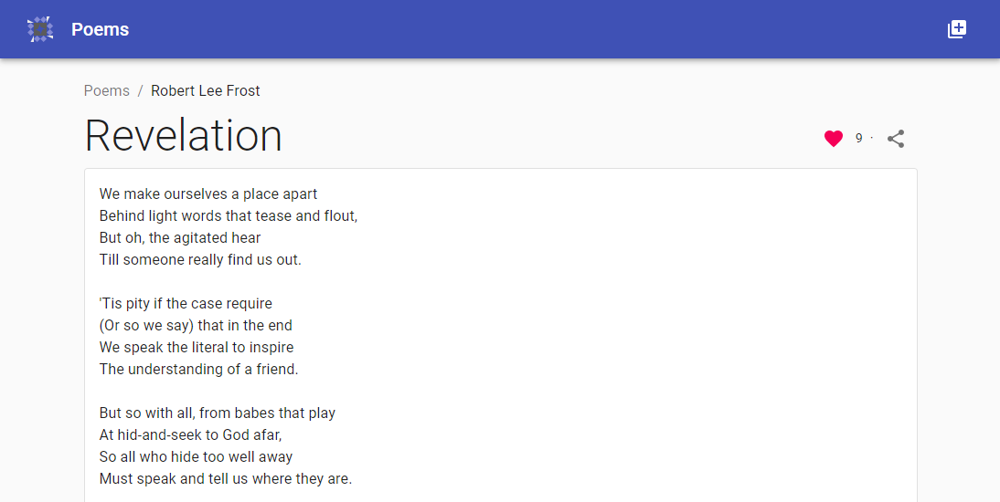
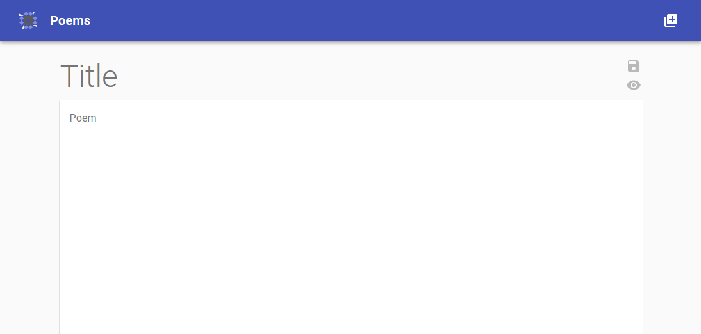

# React Poems

React Poems is a simple project built using React (frontend), Express (backend) and a basic in memory datastore.
A demo is available at: https://enigmatic-ocean-65822.herokuapp.com



[More screenshots](#screenshots)

## Features

These are some of the main features and changes from the original design specification. There are, however, many other subtle additions that have been made to improve user experience and support for different devices and screen resolutions.

* User avatars are dynamically generated based on the users name using the [Jdenticon](https://jdenticon.com/) library
* Share button for each poem which copies the direct link to the clipboard
* Users can preview the rendered markdown of their poem before saving and creating a new poem
* The upvote/downvote functionality was implemented as a favourite button

## Development

The project is targeting the LTS version of node, which is currently `v14.x` and any versions before that are not officially supported.

Run `npm install` to install all the project dependencies.

Run `npm server-dev` to start the express API backend, which will be available at [http://localhost:5000](http://localhost:5000). This will also serve any local builds of the frontend, i.e. files located in `build/`.

Run `npm web-dev` to serve the React frontend, which will be available at [http://localhost:3000](http://localhost:3000). Webpack automatically proxies any requests made to `http://localhost:3000/api` to the express API running on `:5000`.

## Production

To build the app for production run:

```shell
npm run build
npm start
```

This will compile the React frontend and the express server. It will then start the express server which will serve both the frontend and backend.

> Note: that after the build stage `devDependencies` are no longer needed and can be removed with `npm prune --production`

## Deployment

Deployment is done with [Heroku](https://heroku.com), although any service which is able to host a node application can be used. In fact, you could choose to deploy the static assets (i.e. `build/`) and the backend separately.

Heroku will by default run the npm `build` and `start` scripts so no `Procfile` is needed, however, for a more complex or customised deployment a `Procfile` may be useful.

After cloning the repository locally run the following commands to deploy the application to Heroku.

```sh
# login to heroku
heroku login
# create an app on heroku
heroku create
# push the source code to heroku and initiate a build
git push heroku main
```

Once the build is complete you will be given a URL to view the application.

## Libraries

These are the main libraries of note used in the project.

**Material UI**

[Material UI](https://material-ui.com) is used as the UI framework, providing buttons, cards, ripple effects, etc. All components are based on these core components provided by the framework, as well as the [material design specification](https://material.io/design).

**Notistack**

[Notistack](https://iamhosseindhv.com/notistack) is used to easily create and manage multiple snackbars. This library allows us to display global snackbars from within a component that can persist outside of the components lifetime. It also handles displaying multiple snackbars (in a stack) and automatically dismissing them after a delay.

## Screenshots




